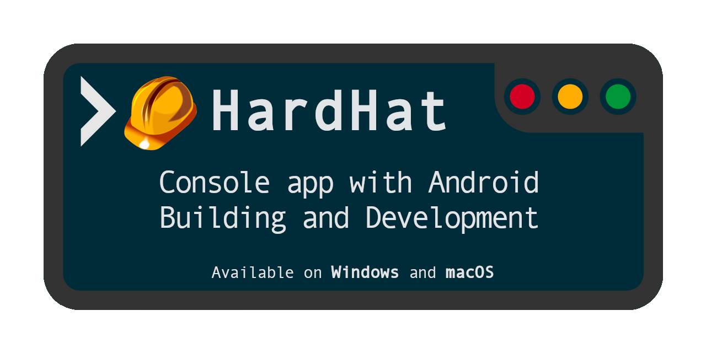

# HardHat [ for Win & Mac ]

[](https://github.com/deinsoftware/hardhat/actions?query=workflow%3Abuild)
[](https://github.com/deinsoftware/hardhat/actions?query=workflow%3Arelease)
[](https://sonarcloud.io/dashboard?id=dein%3Ahardhat)
[](https://sonarcloud.io/dashboard?id=dein%3Ahardhat)
[](https://sonarcloud.io/dashboard?id=dein%3Ahardhat)
[](LICENSE)



**HardHat** was created to simplify and automate tasks related to Android development with help of [ToolBox](https://github.com/deinsoftware/toolbox) and [Colorify](https://github.com/deinsoftware/colorify) libraries.

Previously had created the same app making a Batch (for Windows) and a Bash (for macOS) scripts to make the task, maintain both of them is a hard task to do, but now with .Net Core can use and share the same code on both Operating Systems.

I don't like repetitive tasks and make a build is one of them... yuck!


> The Code is Dark and Full of Errors!
> Console is your friend ... don't be afraid!

## Menu

* [Getting Started](#getting-started)
  * [Prerequisites](#prerequisites)
  * [Installing](#installing)
* [Environment Variables](#environment-variables)
  * [Windows](#environment-for-windows)
  * [macOS](#environment-for-macos)
* [Usage](#usage)
  * [Permissions](#permissions)
  * [Run](#run)
  * [Keyboard Shortcuts](#keyboard-shortcuts)
  * [Setup](#setup)
  * [Recommendations](#recommendations)
* [About](#about)
  * [Built With](#built-with)
  * [Contributing](#contributing)
  * [Versioning](#versioning)
  * [Authors](#authors)
  * [Sponsors](#sponsors)
  * [License](#license)
  * [Acknowledgments](#acknowledgments)

---

## Getting Started

These instructions will get you a copy of the project up and running on your local machine for development and testing purposes.

### Prerequisites

What things do you need to install?

* [Java](http://www.oracle.com/technetwork/java/javase/downloads/index.html)
* [Android SDK](https://developer.android.com/studio/index.html#downloads)
* [Gradle](https://gradle.org/install)
* [Git](https://git-scm.com/downloads)
* [Gulp](http://gulpjs.com/)
* [Node.js](https://nodejs.org/en/download/) (with NPM)
* [SonarQube](https://www.sonarqube.org/)
* [SonarScanner](https://docs.sonarqube.org/display/SCAN/Analyzing+with+SonarQube+Scanner)
* [Sigcheck](https://docs.microsoft.com/en-us/sysinternals/downloads/sigcheck) (only on Windows)
* [.Net Core](https://www.microsoft.com/net/download/core#/runtime) (optional)

It's recommended install it using a Package Manager.

| OS | Instructions |
| --- | --- |
| win | [Chocolatey](https://github.com/deinsoftware/hardhat/blob/master/Docs/Prerequisites/win.md) |
| mac | [Brew and SDK Man](https://github.com/deinsoftware/hardhat/blob/master/Docs/Prerequisites/mac.md) |

### Installing

Follow these steps to install on your local machine

Clone **HardHat** from GitHub on *recommended* path. Using this command on terminal:

| OS | Command |
| --- | --- |
| win | `git clone -b win https://github.com/deinsoftware/hardhat.git "D:\Applications\HardHat"` |
| mac | `git clone -b mac https://github.com/deinsoftware/hardhat.git ~/Applications/HardHat/` |

## Environment Variables

Environment variables are, in short, variables that describe the environment in which programs run in.

Please verify that you have been configured all correctly. Paths in descriptions are examples (recommended) but use your own paths.

### Environment for Windows

| var | description |
| --- | --- |
| `ANDROID_SDK_ROOT` | C:\Android\android-sdk |
| `ANDROID_HOME` | %ANDROID_SDK_ROOT% |
| `ANDROID_NDK_HOME` | %ANDROID_SDK_ROOT%\ndk-bundle |
| `ANDROID_BT_VERSION` | 28.0.3 |
| `ANDROID_PROPERTIES` | D:\Applications\Android\Properties |
| `CHOCO_HOME` | C:\ProgramData\chocolatey |
| `CODE_HOME` | C:\Program Files\Microsoft VS Code |
| `GIT_HOME` | C:\Program Files\Git |
| `GRADLE_HOME` | %CHOCO_HOME% |
| `LFS_HOME` | C:\Program Files\Git LFS |
| `JAVA_HOME` | C:\Program Files\Java\jdk1.8.0_221 |
| `MYSQL_HOME` | C:\tools\mysql\mysql-5.7.18-winx64 |
| `NPM_HOME` | C:\Program Files\nodejs |
| `VPN_HOME` | C:\Program Files (x86)\CheckPoint\Endpoint Connect |
| `SIGCHECK_HOME` | %CHOCO_HOME% |
| `SONAR_QUBE_HOME` | D:\Applications\Sonar\Qube |
| `SONAR_SCANNER_HOME` | %CHOCO_HOME%\lib\sonarqube-scanner.portable\tools\sonar-scanner-3.3.0.1492-windows |
| `TASK_PROJECT` | D:\Applications\Task |
| `PATH` | %ANDROID_SDK_ROOT%\build-tools\\%ANDROID_BT_VERSION%;<br>%ANDROID_SDK_ROOT%\platform-tools;<br>%ANDROID_SDK_ROOT%\platform-tools\bin;<br>%ANDROID_SDK_ROOT%\tools;<br>%CODE_HOME%\bin;<br>%GIT_HOME%\cmd;<br>%GRADLE_HOME%\bin;<br>%JAVA_HOME%\bin;<br>%LFS_HOME%\bin;<br>%MYSQL_HOME%\bin;<br>%NPM_HOME%;<br>%SIGCHECK_HOME%\bin;<br>%SONAR_QUBE_HOME%\bin\windows-x86-64;<br>%SONAR_SCANNER_HOME%\bin;<br>C:\ProgramData\Oracle\Java\javapath; |

On Windows need replace `ANDROID_BT_VERSION` manually with your Android SDK Build Tool version (recommended use the last one).

> **Where are environment variables?**
> In the System Properties window, click on the Advanced tab, then click the Environment Variables button near the bottom of that tab. In the Environment Variables window, highlight the Path variable in the "System variables" section and click the Edit button.

### Environment for macOS

```bash
export ANDROID_SDK_ROOT="/usr/local/share/android-sdk"
export ANDROID_HOME="$ANDROID_SDK_ROOT"
export ANDROID_NDK_HOME="$ANDROID_SDK_ROOT/ndk-bundle"
export ANDROID_BT_VERSION="$(ls -tr $ANDROID_SDK_ROOT/build-tools | sort | tail -1)"
export ANDROID_PROPERTIES="~/Applications/Android/Properties"
export GIT_HOME="/usr/local/bin/git"
export GRADLE_HOME="/usr/local/bin/gradle"
export JAVA_HOME="$(/usr/libexec/java_home -v 1.8)"
export POSTGRESQL_HOME="/usr/local/opt/postgresql"
export SONAR_QUBE_HOME="~/Applications/Sonar/Qube"
export SONAR_SCANNER_HOME="~/Applications/Sonar/Scanner"
export TASK_PROJECT="~/Applications/Task"

export PATH="/opt/local/bin:/opt/local/sbin:/usr/local/sbin:$PATH"
export PATH="$ANDROID_SDK_ROOT/bin:$PATH"
export PATH="$ANDROID_SDK_ROOT/build-tools/$ANDROID_BT_VERSION:$PATH"
export PATH="$ANDROID_SDK_ROOT/platform-tools:$PATH"
export PATH="$ANDROID_SDK_ROOT/tools:$PATH"
export PATH="$ANDROID_NDK_HOME/:$PATH"
export PATH="$SONAR_QUBE_HOME/bin/macosx-universal-64:$PATH"
export PATH="$SONAR_SCANNER_HOME/bin:$PATH"

export PATH="$POSTGRESQL_HOME/bin:$PATH"
export LDFLAGS="-L$POSTGRESQL_HOME/lib"
export CPPFLAGS="-I$POSTGRESQL_HOME/include"

alias hh="sh ~/Applications/HardHat/mac.sh"
alias x="exit"
alias sb="source ~/.bash_profile"
```

On macOS `ANDROID_BT_VERSION` automatically take the last Android SDK Build Tool version. But you can modify it and choose the version that you want. Skip `GRADLE_HOME` and `JAVA_HOME` if you [install these libraries with SDKMan](https://medium.com/@equiman/setup-macos-for-development-5eb1f1506ca5).

With **H**ard**H**at alias, you can open it the application directly from a terminal window using the command `hh` and <kbd>RETURN</kbd> key.

> **Where are environment variables?**
> First, one thing to recognize about OS X is that it is built on Unix. This is where the .bash_profile comes in. When you start the Terminal app in OS X you get a bash shell by default. The bash shell comes from Unix and when it loads it runs the .bash_profile script. You can modify this script for your user to change your settings. This file is located at: `~/.bash_profile`

Highly recommend auto-close option in combination with e**x**it alias. It can be a useful combination to finish and close those unused terminals. Even to exit **HardHat** and close automatically his terminal window.

> **Recommended terminal configurations on macOS?**
> Open a terminal window, go to 'Preference > Profiles.
> Auto close terminal on exit: Inside 'Shell' tab, select "Close if the shell exited cleanly" on "When the shell exits" option.
> Enable Numpad keys: Inside 'Advance' tab, deselect (turn off) "Allow VT100 application keypad mode" option.

⇧ [Back to menu](#menu)

---

## Usage

Keep calm, you are almost done. Review these final steps and enjoy life, no more tedious and repetitive tasks stealing your precious time.

### Permissions

macOS users need add execute permission over some files. Open a terminal on installation path `~/Applications/HardHat/`*recommended* and run this commands:

* `chmod +x mac.sh`
* `chmod +x mac.command`
* `chmod +x cmd.sh`
* `chmod +x HardHat`

### Run

In order to run **HardHat** open a terminal and run this command:

| OS | Path | Command |
| --- | --- | --- |
| win | `"D:\Applications\HardHat"` | `win.bat` |
| mac | `~/Applications/HardHat/` | `sh mac.sh` |

### Start Menu Icon

It's not mandatory but it's highly recommend create and Start Menu icon. This instructions only works with *recommended* path.

#### Star Menu for Windows

Use this commands on terminal (as Admin) to add an icon on your start menu:

```dos
:: Make Dir
md "C:\ProgramData\Microsoft\Windows\Start Menu\Programs\Android"
:: Copy Shortcut
cd /d "D:\Applications\HardHat\"
xcopy "HardHat.lnk" "C:\ProgramData\Microsoft\Windows\Start Menu\Programs\Android"
```

Open **star menu** and over the Android section you will can see the link. Remember mark with 'pin to start' option if you are using Win10.

#### Star Menu for macOS

Select `mac.command` file, then choose `File > Make Alias` or press `Command-L` name it as **Hard Hat** (with blank space between) and add execute permission with `chmod +x "Hard Hat"` command.

Copy the `icon.png` content on the Clipboard. One way to do this is to open the picture in Preview, choose `Edit > Select All`, then choose `Edit > Copy` or press `Command-C`.

Select **Hard Hat** (alias shortcut) file, then choose `File > Get Info`. At the top of the Info window, click the picture of the icon to select it, then choose `Edit > Paste` or press `Command-V`.

Just drag and drop **Hard Hat** (alias shortcut) to your Dock or Desktop.

### Keyboard Shortcuts

Choose the desired letter combination and let **HardHat** work for you.

#### Project

| combination | action |
| --- | --- |
| <kbd>p</kbd> | Select a project inside `path.dir/bsn/prd` path (_see [Setup > Path Variables](#path-variables) section_) that starts with `flt` folder name. This project required to have an `android.prj` folder inside. |
| <kbd>pf</kbd> | Select an APK file generated inside selected project on `android.bld` path with `android.ext` extension name (_see [Setup > Android Variables](#android-variables) section_). |
| <kbd>po</kbd> | Open selected project in File Explorer. |
| <kbd>po-b</kbd> | Open Android build path from selected project in File Explorer. |
| <kbd>pe</kbd> | Open selected project on Editor. (_see [Usage > Configuration > Other Variable](#other-variables) section_). |
| <kbd>pi</kbd> | Install selected file on an Android device. |
| <kbd>pp</kbd> | Show path and full path about selected file. Copy this paths to clipboard. |
| <kbd>pv</kbd> | Show full information, values, signature and hash about selected file. |

##### Editor

| combination | action | path |
| --- | --- | --- |
| <kbd>pe>a</kbd> | Android Studio. **\*** | project/android |
| <kbd>pe>c</kbd> | Visual Studio Code. | project |
| <kbd>pe>s</kbd> | Sublime Text 3. | project |
| <kbd>pe>w</kbd> | Web Storm. **\*** | project |
| <kbd>pe>x</kbd> | Xcode | project/ios |

**\*** Requires enable `Tools -> Create Command-line Launcher` and works only for Linux / macOS.

##### Path

| combination | action |
| --- | --- |
| <kbd>pp>p</kbd> | Copy project path to clipboard. |
| <kbd>pp>f</kbd> | Copy file path to clipboard. |
| <kbd>pp>m</kbd> | Copy mapping file path to clipboard. |
| <kbd>pp>d</kbd> | Duplicate and rename selected file. |
| <kbd>pp>c</kbd> | Compress selected file. |

#### Git

| combination | action |
| --- | --- |
| <kbd>g</kbd> | Show current GIT branch. |
| <kbd>gd</kbd> | Discard files. Launch `reset` command over selected project. |
| <kbd>gp</kbd> | Pull files. Launch `pull` command over selected project. |
| <kbd>gc</kbd> | Clean files. Launch `clean` command over selected project and delete unversioned files over selected project. |
| <kbd>gd+p</kbd> | Discard and Pull files over selected project. |
| <kbd>gr+p</kbd> | Clean and Pull files over selected project. |
| <kbd>go</kbd> | Discard, Clean and Pull (x2) files over selected project. |

#### Task

| combination | action |
| --- | --- |
| <kbd>t</kbd> | Task paths, Server and Log configuration. |
| <kbd>tw</kbd> | Launch `gulp watch` command over selected project to `TASK_PROJECT`. |
| <kbd>tm</kbd> | Launch `gulp make` command over selected project to `TASK_PROJECT`. |
| <kbd>to</kbd> | Make a copy of project files (with an additional backup) and launch `gulp obfuscate` command over selected project to `TASK_PROJECT`. Lite type by default. |
| <kbd>to-l</kbd> | Launch `gulp obfuscate --type lite` command on selected files. |
| <kbd>to-c</kbd> | Launch `gulp obfuscate --type complete` command on all JS and CSS files. |
| <kbd>tr</kbd> | Revert original files to selected project. |
| <kbd>tt</kbd> | Launch `gulp test` command over selected project to `TASK_PROJECT`. Start server according to previous configuration. |
| <kbd>ts</kbd> | Launch `gulp server` command over selected project to `TASK_PROJECT`. Start server according to previous configuration. |
| <kbd>tk</kbd> | Run `kill gulp` command. |
| <kbd>tl</kbd> | Launch `gulp log` command over selected project to `TASK_PROJECT`. |

_See [Environment Variables](#environment-variables) section_ for `TASK_PROJECT` configuration.

##### Path Configuration

| combination | action |
| --- | --- |
| <kbd>t>pw</kbd> | Web Server path with configurations. |
| <kbd>t>pl</kbd> | Log path with configurations. |
| <kbd>t>pe</kbd> | Extension name for configurations. |

##### Server (Web/Log) Configuration

| combination | action |
| --- | --- |
| <kbd>t>si</kbd> | Internal Path inside server configuration. |
| <kbd>t>sc</kbd> | Configuration file with web server configuration. |
| <kbd>t>sf</kbd> | Flavor. |
| <kbd>t>sn</kbd> | Number. |
| <kbd>t>ss</kbd> | Sync Browser on save. |
| <kbd>t>sp</kbd> | Open shortcut in browser at start. |

##### Quick Server Configuration

| combination | option | value |
| --- | --- | --- |
| <kbd>t>f:d</kbd> | Flavor | dev |
| <kbd>t>f:q</kbd> | Flavor | qa |
| <kbd>t>f:r</kbd> | Flavor | drc |
| <kbd>t>f:m</kbd> | Flavor | mnto |
| <kbd>t>f:v</kbd> | Flavor | vsrv |
| <kbd>t>f:p</kbd> | Flavor | prod |
| <kbd>t>n:1</kbd> | Number | 1 |
| <kbd>t>n:2</kbd> | Number | 2 |
| <kbd>t>n:3</kbd> | Number | 3 |
| <kbd>t>n:4</kbd> | Number | 4 |
| <kbd>t>n:5</kbd> | Number | 5 |
| <kbd>t>n:8</kbd> | Number | 8 |
| <kbd>t>n:8</kbd> | Number | 9 |
| <kbd>t>n:8</kbd> | Number | 10 |
| <kbd>t>n:8</kbd> | Number | 11 |

##### Test Server Configuration

| combination | action |
| --- | --- |
| <kbd>t>ts</kbd> | Sync Browser on save. |
| <kbd>t>tc</kbd> | Coverage Path inside server configuration. |

#### Build

| combination | action |
| --- | --- |
| <kbd>b</kbd> | Configure your build type, flavor and dimensions. |
| <kbd>b>t</kbd> | Type shortcut inside build configuration. This value can be empty. |
| <kbd>b>d</kbd> | Dimension shortcut inside build configuration. This value can be empty. |
| <kbd>b>f</kbd> | Flavor shortcut inside build configuration. This value can be empty. |
| <kbd>b>m</kbd> | Mode shortcut inside build configuration. This value can be empty. |
| <kbd>bi</kbd> | Install NPM packages configured on packages.json. |
| <kbd>bp</kbd> | Copy pre-configured files inside `ANDROID_PROPERTIES` (_see [Environment Variables](#environment-variables) section_) folder and copy inside `android.prj` folder in selected project (_see [Setup > Android Variables](#android-variables) section_). |
| <kbd>bc</kbd> | Make `clean` project with gradle command line. |
| <kbd>bc-c</kbd> | Make `cleanBuildCache` project with gradle command line. |
| <kbd>bg</kbd> | Make `build` project with gradle command line. |

If you have some pre-configured files to be copied to the project path, add it on the `ANDROID_PROPERTIES` path (_see [Environment Variables](#environment-variables) section_) inside a Business folder. Files like:

* local.properties
* gradle.properties
* keystore/development.properties
* keystore/production.properties

##### Quick Build Configuration

| combination | option | value |
| --- | --- | --- |
| <kbd>b>t:a</kbd> | Type | assemble |
| <kbd>b>t:b</kbd> | Type | bundle |
| <kbd>b>f:d</kbd> | Flavor | dev |
| <kbd>b>f:q</kbd> | Flavor | qa |
| <kbd>b>f:r</kbd> | Flavor | drc |
| <kbd>b>f:m</kbd> | Flavor | mnto |
| <kbd>b>f:v</kbd> | Flavor | vsrv |
| <kbd>b>f:p</kbd> | Flavor | prod |
| <kbd>b>m:d</kbd> | Mode | Debug |
| <kbd>b>m:s</kbd> | Mode | Stag |
| <kbd>b>m:r</kbd> | Mode | Release |

#### Sonar

| combination | action |
| --- | --- |
| <kbd>s</kbd> | Select and show Sonar configuration. |
| <kbd>s>p</kbd> | Protocol shortcut inside server configuration. |
| <kbd>s>s</kbd> | Server shortcut inside server configuration. |
| <kbd>s>sd</kbd>| Domain shortcut inside server configuration. |
| <kbd>s>sp</kbd>| Port shortcut inside server configuration. |
| <kbd>s>i</kbd> | Internal Path shortcut inside server configuration. |
| <kbd>sq</kbd> | Starts sonar server over `SONAR_QUBE_HOME` (_see [Environment Variables](#environment-variables) section_) |
| <kbd>ss</kbd> | Launch `sonar-scanner` over `SONAR_SCANNER_HOME` (_see [Environment Variables](#environment-variables) section_) inside selected project or his internal path. |s
| <kbd>sb</kbd> | Open sonar configuration on browser. |

#### Android Debug Bridge

| combination | action |
| --- | --- |
| <kbd>ad</kbd> | Show device/emulator list. |
| <kbd>ar</kbd> | Kill and Restart ADB server. |
| <kbd>ad</kbd> | Make ADB launch logcat. |
| <kbd>aw</kbd> | Make a ADB device dis/connection over Wifi. |
| <kbd>aw>i</kbd> | IP shortcut inside wireless configuration. |
| <kbd>aw>p</kbd> | Port shortcut inside wireless configuration. |
| <kbd>aw>c</kbd> | Connect IP shortcut inside wireless configuration. |
| <kbd>as</kbd> | Show device via ADB. |

#### Extra

| combination | action |
| --- | --- |
| <kbd>c</kbd> | Configuration. |
| <kbd>i</kbd> | Show information about commands version. |
| <kbd>e</kbd> | Show information about environmental variables. |
| <kbd>x</kbd> | Exit application, save progress and close terminal window. |
| <kbd>!</kbd> | Repeat previous option. |

### Configuration

Choose <kbd>c</kbd> _Configuration_ option on main menu and set the values.

#### Main Path

| combination | action |
| --- | --- |
| <kbd>md</kbd> | Development path |
| <kbd>mw</kbd> | Choose workspace folder inside development path. |
| <kbd>mp</kbd> | Projects folder name inside workspace folder path. |
| <kbd>mf</kbd> | Filter name for project listing. |

#### Android Path

| combination | action |
| --- | --- |
| <kbd>ap</kbd> | Android folder path inside project |
| <kbd>ab</kbd> | Build folder path inside android project. |
| <kbd>ae</kbd> | Extension name for android application. |
| <kbd>ac</kbd> | Hybrid folder to be processed with Tasks (Uglify & Minify). |
| <kbd>af</kbd> | Filter extension name for files to be processed. |

#### Other Variables

| combination | action |
| --- | --- |
| <kbd>e</kbd> | Command to open editor. |
| <kbd>v</kbd> | VPN Site Name (only for Windows). |
| <kbd>t</kbd> | Theme chooser. |
| <kbd>l</kbd> | Enable or disable log on exceptions. |

### Recommendations

Highly recommend this file and directory structure:

```dir
Developer
├── Workspace1
│   └── Projects
│       ├── _devBranch_1
│       │   ├── android
│       │   ├── ios
│       │   └── web
│       ├── _devBranch_2
│       │   ├── android
│       │   ├── ios
│       │   └── web
│       ├── _devBranch_3
│       │   └── ...
│       ├── _devBranch_n
│       │   └── ...
│       └── _distProject
│           ├── android
│           ├── ios
│           └── web
├── Workspace2
│   └── ...
├── WorkspaceN
│   └── ...
│
Applications
├── Android
│   ├── Gradle
│   ├── Keystore
│   │   ├── Workspace1
│   │   │   ├── dev.jks
│   │   │   └── prd.jks
│   │   ├── Workspace1_Flavor1
│   │   │   └── ...
│   │   ├── Workspace1_Flavor2
│   │   │   └── ...
│   │   ├── Workspace2
│   │   │   └── ...
│   │   └── WorkspaceN
│   │       └── ...
│   ├── PlayStore
│   ├── SDK
│   └── Properties
│       ├── Workspace1
│       │   ├── gradle.properties
│       │   ├── local.properties
|       │   └── Keystore
│       │       ├── development.properties
│       │       └── production.properties
│       ├── Workspace1_Flavor1
│       │   └── ...
│       ├── Workspace1_Flavor2
│       │   └── ...
│       ├── Workspace2
│       │   └── ...
│       └── WorkspaceN
│           └── ...
├── Task
├── HardHat
└── Sonar
    ├── Qube
    └── Scanner
```

⇧ [Back to menu](#menu)

---

## About

### Built With

* [.Net Core](https://dotnet.github.io/) - ASP.NET Core is a free and open-source web framework, and the next generation of ASP.NET, developed by Microsoft and the community.
* [VS Code](https://code.visualstudio.com/) - Code editing redefined.
* [SonarQube](https://sonarcloud.io/dashboard/index/dein:hardhat) - Continuous code quality.

### Contributing

Please read [CONTRIBUTING](CONTRIBUTING.md) for details on our code of conduct, and the process for submitting pull requests to us.

### Versioning

We use [SemVer](http://semver.org/) for versioning. For the versions available, see the [HardHat](https://github.com/deinsoftware/hardhat/tags) on GitHub.

### Authors

* **Camilo Martinez** [[Equiman](http://stackoverflow.com/story/equiman)]

See also the list of [contributors](https://github.com/deinsoftware/hardhat/contributors) who participated in this project.

### Sponsors

If this project help you reduce time to develop, you can give me a cup of coffee.

[](https://paypal.me/equiman/3)
[](https://patreon.com/equiman)
[](https://buymeacoff.ee/equiman)

No sponsors yet! Will you be the first?

### License

This project is licensed under the MIT License - see the [LICENSE](LICENSE) file for details.

### Acknowledgments

* [StackOverflow](http://stackoverflow.com): The largest online community for programmers.
* [XKCD](https://xkcd.com/): A web comic of romance, sarcasm, math and language... for making his [font](https://github.com/ipython/xkcd-font) available.

⇧ [Back to menu](#menu)
