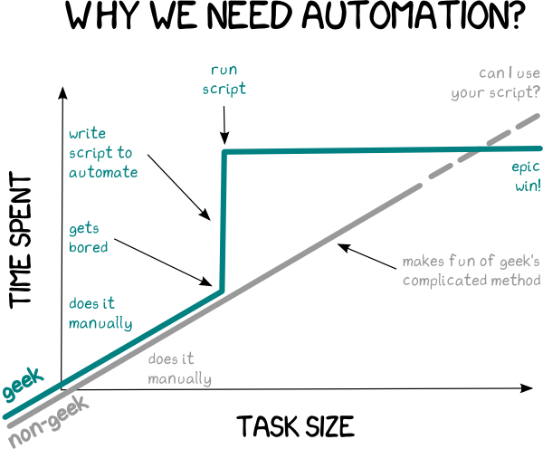

# HardHat [ for Win+Mac ]


**HardHat** was created to simplify and automate tasks related to Android development.

Previously had create the same app making a [Batch (for Windows)](https://github.com/equiman/hardhatwin/) and a [Bash (for macOS)](https://github.com/equiman/hardhatmac/) scripts to make the task, maintain both of them is a hard task to do, but now with .Net Core can use and share the same code on both Operating Systems.

I don't like repetitive tasks and make a build is one of them... yuck!



Contributions or Beer :beers: will be appreciated :thumbsup:

> The Code is Dark and Full of Errors!  
> Console is your friend ... don't be afraid!

## Menu

* [Getting Started](#getting-started)
  * [Prerequisites](#prerequisites)
  * [Installing](#installing)
* [Environment Variables](#environment-variables)
  * [Windows](#environment-for-windows)
  * [macOS](#environment-for-macos)
* [Usage](#usage)
  * [Permissions](#permissions)
  * [Run](#run)
  * [Keyboard Shortcuts](#keyboard-shortcuts)
  * [Setup](#setup)
  * [Recommendations](#recommendations)
* [About](#about)
  * [Built With](#built-with)
  * [Contributing](#contributing)
  * [Versioning](#versioning)
  * [Authors](#authors)
  * [License](#license)
  * [Acknowledgments](#acknowledgments)

---

## Getting Started

These instructions will get you a copy of the project up and running on your local machine for development and testing purposes.

### Prerequisites

What things you need to install?

* [Android SDK](https://developer.android.com/studio/index.html#downloads)
* [Gradle](https://gradle.org/install)
* [Git](https://git-scm.com/downloads)
* [Gulp](http://gulpjs.com/) (to Minify and Uglify)
* [Java](http://www.oracle.com/technetwork/java/javase/downloads/index.html)
* [Node.js](https://nodejs.org/en/download/) (with NPM)
* [SonarQube](https://www.sonarqube.org/)
* [SonarScanner](https://docs.sonarqube.org/display/SCAN/Analyzing+with+SonarQube+Scanner)

Windows only

* [Sigcheck](https://docs.microsoft.com/en-us/sysinternals/downloads/sigcheck) (Windows only)

Optional

* [.Net Core](https://www.microsoft.com/net/download/core#/runtime)


### Installing

Follow this steps to install on your local machine

Clone **HardHat** from GitHub on *recommended* path. Using this command on terminal:

| OS | Command |
| --- | --- |
| win | `git clone -b win https://github.com/equiman/hardhat.git "D:\Applications\HardHat"` |
| mac | `git clone -b mac https://github.com/equiman/hardhat.git ~/Applications/HardHat/` |

## Environment Variables

Environment variables are, in short, variables that describe the environment in which programs run in.

Please verify that you have been configured all correctly. Paths in descriptions are examples (recommended) but use your own paths.

### Environment for Windows

| var | description |
| --- | --- |
| `ANDROID_HOME` | D:\Applications\Android\SDK |
| `ANDROID_NDK_HOME` | %ANDROID_HOME%\ndk-bundle |
| `ANDROID_BT_VERSION` | 26.0.2 |
| `ANDROID_PROPERTIES` | D:\Applications\Android\Properties |
| `CODE_HOME` | C:\Program Files\Microsoft VS Code |
| `GIT_HOME` | C:\Program Files\Git |
| `GRADLE_HOME` | D:\Applications\Android\Gradle |
| `GULP_PROJECT` | D:\Applications\Gulp |
| `JAVA_HOME` | C:\Program Files\Java\jdk1.8.0_74 |
| `NPM_HOME` | C:\Users\\%username%\AppData\Roaming\npm |
| `VPN_HOME` | C:\Program Files (x86)\CheckPoint\Endpoint Connect |
| `SIGCHECK_HOME` | D:\Applications\Sigcheck |
| `SONAR_QUBE_HOME` | D:\Applications\Sonar\Qube |
| `SONAR_SCANNER_HOME` | D:\Applications\Sonar\Scanner |
| `PATH` | %ANDROID_HOME%\build-tools\\%ANDROID_BT_VERSION%;<br>%ANDROID_HOME%\platform-tools;<br>%ANDROID_HOME%\tools;<br>%CODE_HOME%\bin;<br>%GIT_HOME%\cmd;<br>%GRADLE_HOME%\bin;<br>%NPM_HOME%;<br>%SIGCHECK_HOME%\bin;<br>%SONAR_QUBE_HOME%\bin\windows-x86-64<br>%SONAR_SCANNER_HOME%\bin<br>C:\ProgramData\Oracle\Java\javapath;<br>C:\Program Files (x86)\nodejs\; |

Replace `ANDROID_BT_VERSION` with your Android SDK Build Tool version (recommended use the last one).

> **Where are environment variables?**  
> In the System Properties window, click on the Advanced tab, then click the Environment Variables button near the bottom of that tab. In the Environment Variables window, highlight the Path variable in the "System variables" section and click the Edit button.

### Environment for macOS

```bash
export ANDROID_HOME="/usr/local/opt/android-sdk/"
export ANDROID_NDK_HOME="/usr/local/opt/android-sdk/ndk-bundle"
export ANDROID_BT_VERSION="26.0.2"
export ANDROID_PROPERTIES="~/Applications/Android/Properties"
export GIT_HOME="/usr/local/bin/git"
export GRADLE_HOME="/usr/local/bin/gradle"
export GULP_PROJECT="~/Applications/Gulp"
export JAVA_HOME="$(/usr/libexec/java_home -v 1.8)"
export SONAR_QUBE_HOME="~/Applications/Sonar/Qube"
export SONAR_SCANNER_HOME="~/Applications/Sonar/Scanner"

export PATH="/opt/local/bin:/opt/local/sbin:$PATH"
export PATH="$ANDROID_HOME/build-tools/$ANDROID_BT_VERSION:$PATH"
export PATH="$ANDROID_HOME/platform-tools:$PATH"
export PATH="$ANDROID_HOME/tools:$PATH"
export PATH="$ANDROID_NDK_HOME/:$PATH"
export PATH="$SONAR_QUBE_HOME/bin/macosx-universal-64:$PATH"
export PATH="$SONAR_SCANNER_HOME/bin:$PATH"
```

> **Where are environment variables?**  
> First, one thing to recognize about OS X is that it is built on Unix. This is where the .bash_profile comes in. When you start the Terminal app in OS X you get a bash shell by default. The bash shell comes from Unix and when it loads it runs the .bash_profile script. You can modify this script for your user to change your settings. This file is located at: `~/.bash_profile`

⇧ [Back to menu](#menu)

---

## Usage

Keep calm, you are almost done. Review this final steps and enjoy the life, no more tedious and repetitive tasks stealing your precious time.

### Permissions

macOS users need add execute permission over some files. Open a terminal on installation path `~/Applications/HardHat/`*recommended* and run this commands:

* `chmod +x mac.sh`
* `chmod +x mac.command`
* `chmod +x cmd.mac.sh`
* `chmod +x HardHat`

### Run

In order to run **HardHat** open a terminal and run this command:

| OS | Path | Command |
| --- | --- | --- |
| win | `"D:\Applications\HardHat"` | `win.bat` |
| mac | `~/Applications/HardHat/` | `sh mac.sh` |

### Start Menu Icon

It's not mandatory but it's highly recommend create and Start Menu icon. This instructions only works with *recommended* path.

#### Star Menu for Windows

Use this commands on terminal (as Admin) to add an icon on your start menu:

```dos
:: Make Dir
md "C:\ProgramData\Microsoft\Windows\Start Menu\Programs\Android"
:: Copy Shortcut
cd /d "D:\Applications\HardHat\"
xcopy "HardHat.lnk" "C:\ProgramData\Microsoft\Windows\Start Menu\Programs\Android"
```

Open **star menu** and over the Android section you will can see the link. Remember mark with 'pin to start' option if you are using Win10.

#### Star Menu for macOS

Select `mac.command` file, then choose `File > Make Alias` or press `Command-L` name it as **Hard Hat** (with blank space between) and add execute permission with `chmod +x "Hard Hat"` command.

Copy the picture in `icon.png` file  to the Clipboard. One way to do this is to open the picture in Preview, choose `Edit > Select All`, then choose `Edit > Copy` or press `Command-C`.

Select **Hard Hat** (alias shortcut) file, then choose `File > Get Info`. At the top of the Info window, click the picture of the icon to select it, then choose `Edit > Paste` or press `Command-V`.

Just drag and drop **Hard Hat** (alias shortcut) to your Dock or Desktop.

### Keyboard Shortcuts

Choose desired letter combination and let **HardHat** work for you.

> **UPPERCASE** options means default choice in a question, feel free to continue quickly with <kbd>RETURN</kbd> key :wink:

#### Project

| combination | action |
| --- | --- |
| <kbd>p</kbd> | Select a project inside `path.dir/bsn/prd` path (_see [Setup > Path Variables](#path-variables) section_) that starts with `flt` folder name. This project required to have an `android.prj` folder inside. |
| <kbd>pf</kbd> | Select an APK file generated inside selected project on `android.bld` path with `android.ext` extension name (_see [Setup > Android Variables](#android-variables) section_). |
| <kbd>pi</kbd> | Install selected file on an Android device. |
| <kbd>pd</kbd> | Make a copy of selected file and choose a new name. |
| <kbd>pp</kbd> | Show path and full path about selected file. Copy this paths to clipboard. |
| <kbd>ps</kbd> | Show signature information about selected file. |
| <kbd>pv</kbd> | Show full information, values and hash about selected file. |

#### Sonar

| combination | action |
| --- | --- |
| <kbd>s</kbd> | Select and show Sonar configuration. |
| <kbd>s>p</kbd> | Protocol shortcut inside server configuration. |
| <kbd>s>s</kbd> | Server shortcut inside server configuration. |
| <kbd>s>sd</kbd>| Domain shortcut inside server configuration. |
| <kbd>s>sp</kbd>| Port shortcut inside server configuration. |
| <kbd>s>i</kbd> | Internal Path shortcut inside server configuration. |
| <kbd>sq</kbd> | Starts sonar server over `SONAR_QUBE_HOME` (_see [Environment Variables](#environment-variables) section_) |
| <kbd>ss</kbd> | Launch `sonar-scanner` over `SONAR_SCANNER_HOME` (_see [Environment Variables](#environment-variables) section_) inside selected project or his internal path. |s
| <kbd>sb</kbd> | Open sonar configuration on browser. |

#### Version Control System

| combination | action |
| --- | --- |
| <kbd>v</kbd> | Show current GIT branch. |
| <kbd>vd</kbd> | Discard files. Launch `reset` command over selected project. |
| <kbd>vp</kbd> | Pull files. Launch `pull` command over selected project. |
| <kbd>vc</kbd> | Clean files. Launch `clean` command over selected project and delete unversioned files over selected project. |
| <kbd>vd+p</kbd> | Discard and Pull files over selected project. |
| <kbd>vr+p</kbd> | Clean and Pull files over selected project. |

#### Gulp

| combination | action |
| --- | --- |
| <kbd>g</kbd> | Select and show development server configuration. |
| <kbd>g>i</kbd> | Internal Path shortcut inside server configuration. |
| <kbd>g>d</kbd> | Dimension shortcut inside server configuration. |
| <kbd>g>f</kbd> | Flavor shortcut inside server configuration. |
| <kbd>g>n</kbd> | Number shortcut inside server configuration. |
| <kbd>g>s</kbd> | Sync shortcut inside server configuration. |
| <kbd>g>p</kbd> | Protocol shortcut inside server configuration. |
| <kbd>gm</kbd> | Launch `gulp make` command over selected project to `GULP_PROJECT` (_see [Environment Variables](#environment-variables) section_). |
| <kbd>gu</kbd> | Make a copy of project files (with an additional backup) and launch `gulp build` command over selected project to `GULP_PROJECT` (_see [Environment Variables](#environment-variables) section_). |
| <kbd>gr</kbd> | Revert original files to selected project. |
| <kbd>gs</kbd> | Launch `gulp default` command over selected project to `GULP_PROJECT` (_see [Environment Variables](#environment-variables) section_). Start server according to previous configuration. |
| <kbd>gl</kbd> | Launch `gulp log` command over selected project to `GULP_PROJECT` (_see [Environment Variables](#environment-variables) section_). |

Gulp Uglify process was create under `build` task and configured to use some folders. We recommend follow the same structure.

| folder | description |
| --- | --- |
| `bld` | Result from magic |
| `www` | Original project files |

Gulp Make process was created under `make` task and follow this command help:

~~~console
gulp make --prj path_value [--ptf platform_value]
~~~

Gulp Browser process was created under `default` task and follow this command help:

~~~console
gulp [default] --pth path_value [--ipt internalPath_value] --dmn dimension_value [--ptc http/https --flv flavor_value --srv server_number --host ip_value --sync Y/N --open Y/N --os os_name]
~~~

Gulp Log process was created under `log` task and follow this command help:

~~~console
gulp log --dmn dimension_value [--flv flavor_value --srv server_number]
~~~

| parameter | description |
| --- | --- |
| `pth` | Selected project path |
| `dmn` | Server configuration file name under server folder |
| `flv` | Flavor |
| `flv` | Server Number (if have multiple servers with same flavor) |
| `sync` | Enable or disable browserSync task |
| `host` | External IP address access |

| parameter | description |
| --- | --- |
| `pth` | Selected project path |
| `ipt` | web files path inside `pth` |
| `dmn` | Server configuration file name under `server` folder |
| `flv` | Flavor **A**lfa/**B**eta/**S**tag/**P**rod.|
| `srv` | Server Number (if have multiple servers with same flavor) |
| `sync` | (**Y**) Enable or (**N**) Disable Browser Sync. |
| `host` | External IP address access |
| `ptc` | **http** or **https**. |
| `os` | **win** or **mac**. |

#### Build

| combination | action |
| --- | --- |
| <kbd>b</kbd> | Configure your build type, flavor and dimensions. |
| <kbd>g>s</kbd> | Dimension shortcut inside build configuration. This value can be empty. |
| <kbd>g>f</kbd> | Flavor shortcut inside build configuration. This value can be empty. |
| <kbd>g>m</kbd> | Mode shortcut inside build configuration. This value can be empty. |
| <kbd>bp</kbd> | Copy pre-configured files inside `ANDROID_PROPERTIES` (_see [Environment Variables](#environment-variables) section_) folder and copy inside `android.prj` folder in selected project (_see [Setup > Android Variables](#android-variables) section_). |
| <kbd>bc</kbd> | Make `clean` project with gradle command line. |
| <kbd>bg</kbd> | Make `clean` and `build` project with gradle command line. |

If you have some pre-configured files to be copied to project path, add it on `ANDROID_PROPERTIES` path (_see [Environment Variables](#environment-variables) section_) inside a Business folder. Files like:

* local.properties
* gradle.properties
* keystore/development.properties
* keystore/production.properties

#### Android Debug Bridge

| combination | action |
| --- | --- |
| <kbd>ad</kbd> | Show device/emulator list. |
| <kbd>aw</kbd> | Make a ADB device dis/connection over Wifi. |
| <kbd>ar</kbd> | Kill and Restart ADB server. |

#### Extra

| combination | action |
| --- | --- |
| <kbd>c</kbd> | Configuration. |
| <kbd>i</kbd> | Show information about commands version. |
| <kbd>e</kbd> | Show information about environmental variables. |
| <kbd>x</kbd> | Exit application, save progress and close terminal window. |

> **How to auto close terminal on exit for macOS?**  
> Open a terminal window, goto 'Preference > Profiles > Shell' and select "Close if the shell exited cleanly" on "When the shell exits" option.

### Setup

Choose <kbd>c</kbd> _Configuration_ option on main menu and set the values.

#### Path Variables

| var | description |
| --- | --- |
| `dir` | Development path |
| `bsn` | Business folder inside `dir` path  |
| `prd` | Project folder inside `bsn` path |
| `flt` | Filter name folder for projects list |

#### Android Variables

| var | description |
| --- | --- |
| `prj` | Android folder name inside selected project |
| `bld` | Build path inside `prj` path |
| `ext` | APK extension name |
| `cmp` | Files path inside `prj` path to be compacted with gulp |
| `flt` | Filter extension name to be compacted with gulp |

#### Gulp Variables

| var | description |
| --- | --- |
| `srv` | Server folder name inside `GULP_PROJECT` |
| `ext` | Filter extension name for server configuration |

#### VPN Variables

| var | description |
| --- | --- |
| `snm` | Site name for `VPN_HOME` |

### Recommendations

Highly recommend this file and directory structure:

```dir
Developer
├── Business_1
│   └── Projects
│       ├── _devBranch_1
│       │   ├── android
│       │   ├── ios
│       │   └── web
│       ├── _devBranch_2
│       │   ├── android
│       │   ├── ios
│       │   └── web
│       ├── _devBranch_3
│       │   └── ...
│       ├── _devBranch_n
│       │   └── ...
│       └── _distProject
│           ├── android
│           ├── ios
│           └── web
├── Business_2
│   └── ...
├── Business_n
│   └── ...
│
Applications
├── Android
│   ├── Gradle
│   ├── Keystore
│   │   ├── dev.jks
│   │   └── prd.jks
│   ├── PlayStore
│   ├── SDK
│   └── Properties
│       ├── Business_1
│       │   ├── gradle.properties
│       │   ├── local.properties
|       │   └── Keystore
│       │       ├── development.properties
│       │       └── production.properties
│       ├── Business_2
│       │   └── ...
│       └── Business_n
│           └── ...
├── Gulp
├── HardHat
└── Sonar
    ├── Qube
    └── Scanner
```

⇧ [Back to menu](#menu)

---

## About

### Built With

* [VS Code](https://code.visualstudio.com/) - Code editing redefined.

### Contributing

Please read [CONTRIBUTING](CONTRIBUTING.md) for details on our code of conduct, and the process for submitting pull requests to us.

### Versioning

We use [SemVer](http://semver.org/) for versioning. For the versions available, see the [HardHat](https://github.com/equiman/hardhat/tags) on GitHub.

### Authors

* **Camilo Martinez** [[Equiman](http://stackoverflow.com/story/equiman)]

See also the list of [contributors](https://github.com/equiman/hardhat/contributors) who participated in this project.

### License

This project is licensed under the GNU GPLv3 License - see the [LICENSE](LICENSE) file for details.

### Acknowledgments

* Beta testers: [Ricardo Mesa](https://github.com/rmesaf) and [Sebastian Loaiza](https://github.com/slmartinez).
* [StackOverflow](http://stackoverflow.com): The largest online community for programmers.
* [XKCD](https://xkcd.com/): A web comic of romance, sarcasm, math and language... for making his [font](https://github.com/ipython/xkcd-font) available.

⇧ [Back to menu](#menu)
